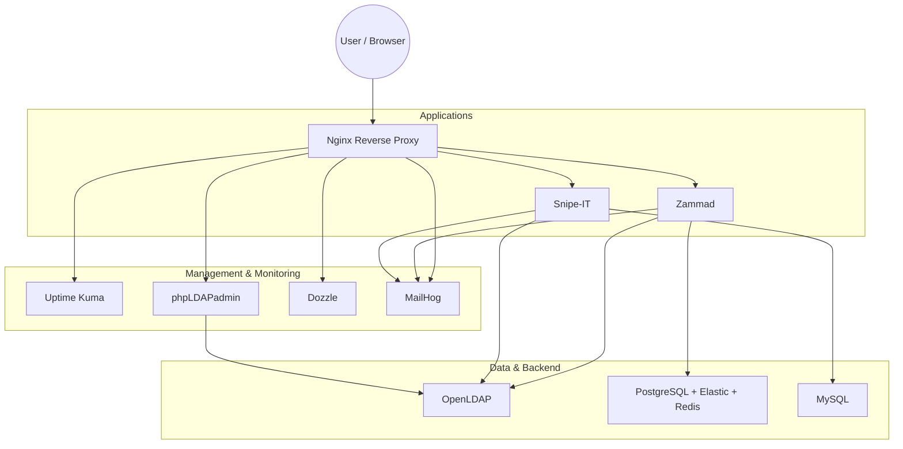
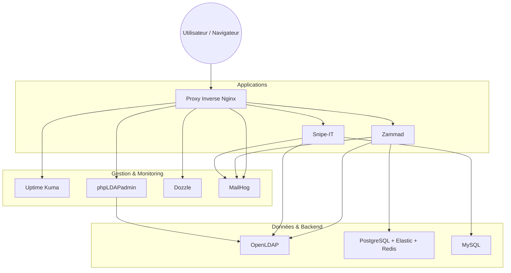

# Containerized Ticketing Infrastructure
**Status:** Operational

## 🌐 Language

<details>
<summary>🇺🇸 English</summary>

## 🎯 Project Objective
This project deploys a complete containerized IT infrastructure for ticket and IT inventory management. It uses **Docker Compose** to orchestrate multiple interconnected open-source services.

The infrastructure is deployed automatically, but fine-tuning of applications (LDAP, SMTP, etc.) is done via graphical interfaces to meet educational objectives and better understand the tools.

### Deployed Services
*   **Zammad:** Ticketing and customer support system.
*   **Snipe-IT:** IT inventory management (ITAM).
*   **OpenLDAP:** Centralized directory (pre-populated with users/groups).
*   **phpLDAPadmin:** Web interface for OpenLDAP management (visual user creation).
*   **Uptime Kuma:** Infrastructure monitoring.
*   **Dozzle:** Real-time log visualization.
*   **MailHog:** Test email server (SMTP trap).
*   **Nginx:** Reverse proxy for unified access via subdomains.

> ⚠️ **Note:** Strictly limited to test/lab environment (disposable data, non-secure passwords).

---

## 🏗️ Architecture

The infrastructure is organized into functional layers, accessible through subdomains on port 80.



*(If the diagram above does not render, here is the text view:)*

*   **Entry Point:** Nginx (Reverse Proxy) handles routing via subdomains (zammad.lvh.me, snipeit.lvh.me, etc.).
*   **Application Layer:** Zammad (Ticketing), Snipe-IT (Inventory).
*   **Management Layer:** phpLDAPadmin (Directory UI), Dozzle (Logs), Uptime Kuma (Monitoring).
*   **Backend Services:** OpenLDAP (Auth), PostgreSQL/MySQL (Databases), Elasticsearch, Redis.

---

## 📋 Prerequisites
*   **Git:** To clone the repository.
*   **Docker:** Version 20.10+ with Docker Compose V2.
*   **Web Browser:** To access interfaces.
*   **Resources:** At least **6 GB RAM** recommended (Elasticsearch + Zammad are resource-intensive).

---

## 🚀 Installation and Deployment

### 1. Clone the repository
```bash
git clone https://github.com/AnythingLegalConsidered/Ticketing
cd Ticketing
```

### 2. Configure the environment
Copy the example file and modify variables if needed (domain, passwords):
```bash
cp .env.example .env
```

### 3. DNS Configuration
**No configuration required!** Services are accessible via lvh.me subdomains (automatically resolve to 127.0.0.1).

### 4. Start the stack
```bash
make setup
# OR manually:
# docker compose up -d
```

### 5. Initialization
*   **Automatic:** The setup container will populate OpenLDAP with test data and create the initial Admin user for Zammad.
*   **Manual Steps (Required):**
    *   **Snipe-IT:** Go to `http://snipeit.lvh.me/setup` and complete the installation wizard.
    *   **Zammad:** Log in, then configure **LDAP** and **SMTP** integrations in the settings using the credentials below.
    *   **Uptime Kuma:** Create your admin account and configure probes.

---

## 🌐 Service Access

| Service | URL | Credentials / Status |
| :--- | :--- | :--- |
| **Zammad** | `http://zammad.lvh.me` | **Login:** `admin@ticketing.local` <br> **Pass:** `admin123` |
| **Snipe-IT** | `http://snipeit.lvh.me` | **Status:** Complete Wizard <br> **DB:** `snipeit` / `snipeit` / `snipeit_password` |
| **phpLDAPadmin** | `http://ldap.lvh.me` | **Login:** `cn=admin,dc=ticketing,dc=local` <br> **Pass:** (See `.env`) |
| **Uptime Kuma** | `http://uptime.lvh.me` | **Status:** Create admin account |
| **Dozzle** | `http://dozzle.lvh.me` | **Status:** Free access |
| **MailHog** | `http://mailhog.lvh.me` | **Status:** Free access |

### 👥 LDAP User Management
Users are pre-populated, but you can manage them via **phpLDAPadmin**:
1.  Go to `http://ldap.lvh.me`.
2.  Log in with the Admin DN.
3.  **Create new users manually** via the graphical interface (Create a child entry -> Generic: User Account).

**Default Test Users:**
*   **Tech N1:** chris.letech
*   **Tech N2:** robert.lemodo
*   **Tech N3:** bob.ladmin
*   **Clients:** jean.user
*   **Default password:** `password`

---

## 🛠️ Useful Commands

### Via Makefile (Recommended)
```bash
make setup       # 🚀 Complete setup (build + up + setup logs)
make up          # Start infrastructure
make down        # Stop infrastructure
make status      # Check containers status
make logs        # View logs of all services
make clean       # ⚠️ Complete cleanup (removes containers AND volumes)
```

### Via Docker Compose
```bash
docker compose up -d                 # Start
docker compose logs -f [service]     # Logs
docker compose restart [service]     # Restart specific app
docker compose down -v               # Remove everything
```

---

## 📁 Project Structure

```text
.
├── Makefile                   # Shortcuts for management
├── docker-compose.yml         # Main orchestration file
├── .env                       # Centralized configuration
├── README.md                  # Documentation
│
├── elasticsearch/             # Custom ES configuration
├── nginx/
│   └── conf.d/                # Reverse Proxy Configs (Vhosts)
├── openldap/
│   └── Dockerfile             # Custom LDAP image
├── scripts/                   # Init scripts (LDAP bootstrap, etc.)
└── zammad/                    # Zammad specific scripts
```

---

## 🔧 Customization
**Environment Variables (.env):**
*   `DOMAIN=ticketing.local`: Base domain.
*   `LDAP_ROOT_PASSWORD`: Password for `cn=admin`.
*   `POSTGRES_PASSWORD` / `MYSQL_PASSWORD`: DB passwords.

**Adding Users:**
You can add users in `openldap/add-entries.ldif` before building, or simply use **phpLDAPadmin** after deployment.

---

## 📊 Project Status
*   ✅ **Infrastructure:** Deployed and functional.
*   ✅ **Monitoring:** Uptime Kuma and Dozzle integrated.
*   ✅ **LDAP:** Automatically populated + GUI management added.
*   🔄 **Configuration:** Manual configuration via GUI required for Zammad/Snipe-IT (Educational objective).

---

## 📄 License
This project is under MIT license - see the LICENSE file for details.

</details>

<details>
<summary>🇫🇷 Français</summary>

## 🎯 Objectif du Projet
Ce projet déploie une infrastructure IT complète conteneurisée pour la gestion des tickets et de l'inventaire IT. Il utilise **Docker Compose** pour orchestrer plusieurs services open-source interconnectés.

L'infrastructure est déployée automatiquement, mais l'affinage des applications (LDAP, SMTP, etc.) se fait via des interfaces graphiques pour répondre aux objectifs pédagogiques et mieux comprendre les outils.

### Services Déployés
*   **Zammad :** Système de ticketing et support client.
*   **Snipe-IT :** Gestion d'inventaire IT (ITAM).
*   **OpenLDAP :** Annuaire centralisé (pré-rempli avec utilisateurs/groupes).
*   **phpLDAPadmin :** Interface web pour la gestion OpenLDAP (création visuelle d'utilisateurs).
*   **Uptime Kuma :** Monitoring d'infrastructure.
*   **Dozzle :** Visualisation des logs en temps réel.
*   **MailHog :** Serveur de test email (piège SMTP).
*   **Nginx :** Proxy inverse pour un accès unifié via sous-domaines.

> ⚠️ **Note :** Strictement limité à un environnement de test/lab (données jetables, mots de passe non-sécurisés).

---

## 🏗️ Architecture

L'infrastructure est organisée en couches fonctionnelles, accessibles via des sous-domaines sur le port 80.



*(Si le diagramme ci-dessus ne s'affiche pas, voici la vue texte :)*

*   **Point d'entrée :** Nginx (Proxy Inverse) gère le routage via sous-domaines (zammad.lvh.me, snipeit.lvh.me, etc.).
*   **Couche Application :** Zammad (Ticketing), Snipe-IT (Inventaire).
*   **Couche Gestion :** phpLDAPadmin (Interface Annuaire), Dozzle (Logs), Uptime Kuma (Monitoring).
*   **Services Backend :** OpenLDAP (Auth), PostgreSQL/MySQL (Bases de données), Elasticsearch, Redis.

---

## 📋 Prérequis
*   **Git :** Pour cloner le dépôt.
*   **Docker :** Version 20.10+ avec Docker Compose V2.
*   **Navigateur Web :** Pour accéder aux interfaces.
*   **Ressources :** Au moins **6 GB RAM** recommandés (Elasticsearch + Zammad sont gourmands en ressources).

---

## 🚀 Installation et Déploiement

### 1. Cloner le dépôt
```bash
git clone https://github.com/AnythingLegalConsidered/Ticketing
cd Ticketing
```

### 2. Configurer l'environnement
Copier le fichier d'exemple et modifier les variables si nécessaire (domaine, mots de passe) :
```bash
cp .env.example .env
```

### 3. Configuration DNS
**Aucune configuration requise !** Les services sont accessibles via les sous-domaines lvh.me (résolvent automatiquement vers 127.0.0.1).

### 4. Démarrer la stack
```bash
make setup
# OU manuellement :
# docker compose up -d
```

### 5. Initialisation
*   **Automatique :** Le conteneur de setup va peupler OpenLDAP avec des données de test et créer l'utilisateur Admin initial pour Zammad.
*   **Étapes Manuelles (Requises) :**
    *   **Snipe-IT :** Aller sur `http://snipeit.lvh.me/setup` et compléter l'assistant d'installation.
    *   **Zammad :** Se connecter, puis configurer les intégrations **LDAP** et **SMTP** dans les paramètres en utilisant les identifiants ci-dessous.
    *   **Uptime Kuma :** Créer votre compte administrateur et configurer les sondes.

---

## 🌐 Accès aux Services

| Service | URL | Identifiants / Statut |
| :--- | :--- | :--- |
| **Zammad** | `http://zammad.lvh.me` | **Login :** `admin@ticketing.local` <br> **Pass :** `admin123` |
| **Snipe-IT** | `http://snipeit.lvh.me` | **Statut :** Compléter l'Assistant <br> **DB :** `snipeit` / `snipeit` / `snipeit_password` |
| **phpLDAPadmin** | `http://ldap.lvh.me` | **Login :** `cn=admin,dc=ticketing,dc=local` <br> **Pass :** (Voir `.env`) |
| **Uptime Kuma** | `http://uptime.lvh.me` | **Statut :** Créer compte admin |
| **Dozzle** | `http://dozzle.lvh.me` | **Statut :** Accès libre |
| **MailHog** | `http://mailhog.lvh.me` | **Statut :** Accès libre |

### 👥 Gestion des Utilisateurs LDAP
Les utilisateurs sont pré-remplis, mais vous pouvez les gérer via **phpLDAPadmin** :
1.  Aller sur `http://ldap.lvh.me`.
2.  Se connecter avec le DN Admin.
3.  **Créer de nouveaux utilisateurs manuellement** via l'interface graphique (Créer une entrée enfant -> Compte utilisateur générique).

**Utilisateurs de Test par Défaut :**
*   **Tech N1 :** chris.letech
*   **Tech N2 :** robert.lemodo
*   **Tech N3 :** bob.ladmin
*   **Clients :** jean.user
*   **Mot de passe par défaut :** `password`

---

## 🛠️ Commandes Utiles

### Via Makefile (Recommandé)
```bash
make setup       # 🚀 Configuration complète (build + up + logs setup)
make up          # Démarrer l'infrastructure
make down        # Arrêter l'infrastructure
make status      # Vérifier le statut des conteneurs
make logs        # Voir les logs de tous les services
make clean       # ⚠️ Nettoyage complet (supprime conteneurs ET volumes)
```

### Via Docker Compose
```bash
docker compose up -d                 # Démarrer
docker compose logs -f [service]     # Logs
docker compose restart [service]     # Redémarrer une app spécifique
docker compose down -v               # Tout supprimer
```

---

## 📁 Structure du Projet

```text
.
├── Makefile                   # Raccourcis de gestion
├── docker-compose.yml         # Fichier d'orchestration principal
├── .env                       # Configuration centralisée
├── README.md                  # Documentation
│
├── elasticsearch/             # Configuration ES personnalisée
├── nginx/
│   └── conf.d/                # Configs Proxy Inverse (Vhosts)
├── openldap/
│   └── Dockerfile             # Image LDAP personnalisée
├── scripts/                   # Scripts d'initialisation (bootstrap LDAP, etc.)
└── zammad/                    # Scripts spécifiques Zammad
```

---

## 🔧 Personnalisation
**Variables d'Environnement (.env) :**
*   `DOMAIN=ticketing.local` : Domaine de base.
*   `LDAP_ROOT_PASSWORD` : Mot de passe pour `cn=admin`.
*   `POSTGRES_PASSWORD` / `MYSQL_PASSWORD` : Mots de passe DB.

**Ajouter des Utilisateurs :**
Vous pouvez ajouter des utilisateurs dans `openldap/add-entries.ldif` avant le build, ou simplement utiliser **phpLDAPadmin** après le déploiement.

---

## 📊 Statut du Projet
*   ✅ **Infrastructure :** Déployée et fonctionnelle.
*   ✅ **Monitoring :** Uptime Kuma et Dozzle intégrés.
*   ✅ **LDAP :** Peupler automatiquement + gestion GUI ajoutée.
*   🔄 **Configuration :** Configuration manuelle via GUI requise pour Zammad/Snipe-IT (Objectif pédagogique).

---

## 📄 Licence
Ce projet est sous licence MIT - voir le fichier LICENSE pour plus de détails.

</details>
