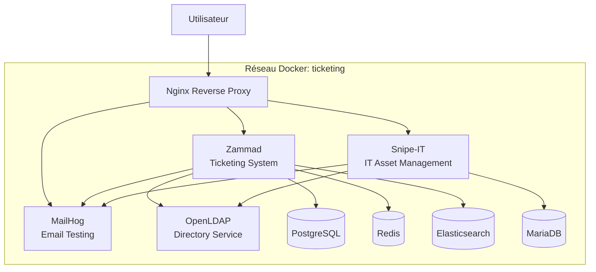

# Infrastructure IT Conteneurisée


## 🎯 Objectif du Projet

Ce projet déploie une infrastructure IT complète et conteneurisée pour la gestion des tickets et de l'inventaire informatique. Il utilise Docker Compose pour orchestrer plusieurs services open-source interconnectés :

- **Zammad** : Système de ticketing et support client
- **Snipe-IT** : Gestion d'inventaire IT (ITAM)
- **OpenLDAP** : Annuaire centralisé pour l'authentification
- **MailHog** : Serveur de test pour les e-mails
- **Nginx** : Reverse proxy pour l'accès unifié

L'ensemble est entièrement automatisé : un seul script configure les intégrations SMTP et LDAP après le déploiement.

**⚠️ Usage strictement limité à l'environnement de test/lab (données jetables, mots de passe non sécurisés).**

## 🏗️ Architecture



## 📋 Prérequis

- **Git** : Pour cloner le dépôt
- **Docker** : Version 20.10+ avec Docker Compose V2
- **Navigateur web** : Pour accéder aux interfaces
- **Ressources** : Au minimum 4 Go RAM (Elasticsearch est gourmand)

## 🚀 Installation et Déploiement

1. **Clonez le dépôt :**
   ```bash
   git clone https://github.com/votre-username/it-stack-project.git
   cd it-stack-project
   ```

2. **Configurez l'environnement :**
   - Copiez le fichier `.env.example` vers `.env` (si fourni) ou créez-le avec vos valeurs
   - Modifiez les variables selon vos besoins (domaine, mots de passe)

3. **Ajoutez les domaines à votre fichier hosts :**
   ```bash
   # Windows (PowerShell en admin)
   Add-Content -Path "C:\Windows\System32\drivers\etc\hosts" -Value "127.0.0.1 zammad.projet.lan snipeit.projet.lan mail.projet.lan"
   ```

4. **Démarrez la stack :**
   ```bash
   docker compose up -d
   ```

5. **Exécutez la configuration automatique :**
   ```bash
   ./configure.sh
   ```

6. **Attendez la synchronisation :**
   - Patientez 2-3 minutes pour que les synchros LDAP se terminent

7. **Accédez aux services :**
   Votre stack est prête !

## 🌐 Accès aux Services

| Service | URL | Utilisateur Test | Mot de Passe |
|---------|-----|------------------|--------------|
| Zammad | http://zammad.projet.lan | johndoe | password |
| Snipe-IT | http://snipeit.projet.lan | johndoe | password |
| MailHog | http://mail.projet.lan | N/A | N/A |

**Administrateur OpenLDAP :**
- DN : `cn=admin,dc=projet,dc=lan`
- Mot de passe : Voir `LDAP_ROOT_PASSWORD` dans `.env`

## 🛠️ Commandes Utiles

### Gestion de la stack
```bash
# Démarrer tous les services
docker compose up -d

# Arrêter tous les services
docker compose down

# Voir les logs
docker compose logs -f [service-name]

# Redémarrer un service spécifique
docker compose restart [service-name]

# Supprimer tout (y compris les données)
docker compose down -v
```

### Développement
```bash
# Rebuild une image personnalisée
docker compose build [service-name]

# Accéder à un conteneur
docker compose exec [service-name] bash
```

## 📁 Structure du Projet

```
.
├── docker-compose.yml          # Orchestration principale
├── .env                        # Configuration centralisée
├── configure.sh                # Script d'automatisation
├── README.md                   # Cette documentation
│
├── elasticsearch/
│   └── Dockerfile              # Image ES avec plugin
├── nginx/
│   └── conf.d/                 # Configurations vhost
├── openldap/
│   ├── Dockerfile              # Image LDAP avec LDIF
│   └── *.ldif                  # Structures d'annuaire
├── scripts/                    # Scripts utilitaires
└── plan/                       # Documentation détaillée
```

## 🔧 Personnalisation

### Variables d'environnement (.env)
- `DOMAIN=projet.lan` : Domaine de base
- `LDAP_ROOT_PASSWORD` : Mot de passe admin LDAP
- `POSTGRES_PASSWORD` : Mot de passe PostgreSQL
- `MYSQL_PASSWORD` : Mot de passe MariaDB
- `SNIPEIT_APP_KEY` : Clé d'application Snipe-IT

### Ajout d'utilisateurs LDAP
Modifiez `openldap/add-entries.ldif` et relancez le bootstrap.

## 📊 État du Projet

- ✅ **P0-P5** : Infrastructure déployée et intégrée (85% complété)
- 🔄 **P6** : Automatisation (scripts créés)
- 🔄 **P7** : Documentation (en cours)

Voir `plan/Plan.md` pour le détail complet.

## 🤝 Contribution

1. Fork le projet
2. Créez une branche feature (`git checkout -b feature/AmazingFeature`)
3. Committez vos changements (`git commit -m 'Add some AmazingFeature'`)
4. Pushez vers la branche (`git push origin feature/AmazingFeature`)
5. Ouvrez une Pull Request

## 📄 Licence

Ce projet est sous licence MIT - voir le fichier `LICENSE` pour plus de détails.

## 🆘 Support

- **Issues** : [GitHub Issues](https://github.com/votre-username/it-stack-project/issues)
- **Documentation** : Consultez le dossier `plan/` pour les guides détaillés
- **Logs** : `docker compose logs` pour diagnostiquer les problèmes