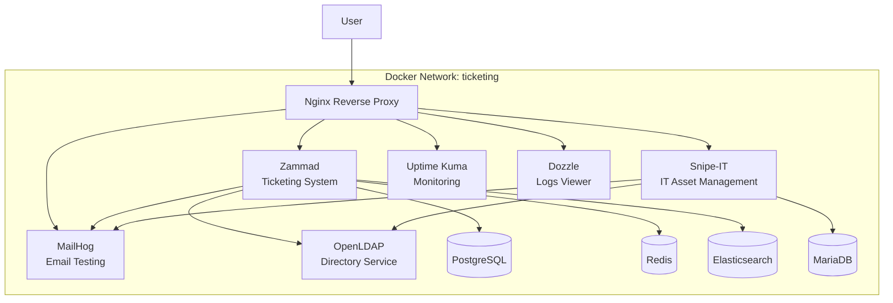

# Containerized Ticketing Infrastructure


## 🎯 Project Objective

This project deploys a complete containerized IT infrastructure for ticket and IT inventory management. It uses Docker Compose to orchestrate multiple interconnected open-source services.

The infrastructure is deployed automatically, but fine-tuning of applications (LDAP, SMTP, etc.) is done via graphical interfaces for better understanding of the tools.

### Deployed Services:
- **Zammad**: Ticketing and customer support system
- **Snipe-IT**: IT inventory management (ITAM)
- **OpenLDAP**: Centralized directory (pre-populated with users/groups)
- **Uptime Kuma**: Infrastructure monitoring
- **Dozzle**: Real-time log visualization
- **MailHog**: Test email server
- **Nginx**: Reverse proxy for unified access

**⚠️ Strictly limited to test/lab environment (disposable data, non-secure passwords).**

## 🏗️ Architecture



## 📋 Prerequisites

- **Git**: To clone the repository
- **Docker**: Version 20.10+ with Docker Compose V2
- **Web Browser**: To access interfaces
- **Resources**: At least 6 GB RAM recommended (Elasticsearch + Zammad are resource-intensive)

## 🚀 Installation and Deployment

1. **Clone the repository:**
   ```bash
   git clone https://github.com/your-username/it-stack-project.git
   cd it-stack-project
   ```

2. **Configure the environment:**
   - Copy the `.env.example` file to `.env` (if provided) or create it with your values
   - Modify variables as needed (domain, passwords)

3. **Add domains to your hosts file:**
   ```powershell
   # Windows (PowerShell as admin)
   Add-Content -Path "C:\Windows\System32\drivers\etc\hosts" -Value "127.0.0.1 zammad.projet.lan snipeit.projet.lan mail.projet.lan monitor.projet.lan logs.projet.lan"
   ```

4. **Start the complete stack:**
   ```bash
   make setup
   # OR manually:
   # docker compose up -d
   ```

5. **Automatic Initialization (Setup Script):**
   - The `setup` container will:
     - Populate the LDAP directory with test data.
     - Create the initial Admin user for Zammad.
   - Monitor progress with `make configure`.

6. **Manual Configuration (To be done by you):**
   - **Snipe-IT**: Go to the URL and follow the web installation wizard.
   - **Zammad**: Log in and configure LDAP and SMTP integration in settings.
   - **Uptime Kuma**: Create your admin account and add your probes.

## 🌐 Service Access

| Service | URL | Credentials / Status |
|---------|-----|------------------|
| **Zammad** | http://zammad.projet.lan | **Login:** `admin@projet.lan` <br> **Pass:** `admin123` <br> *(To configure: LDAP, SMTP)* |
| **Snipe-IT** | http://snipeit.projet.lan | **Status:** Installation wizard to complete <br> **DB:** `snipeit` / `snipeit` / `snipeit_password` |
| **Uptime Kuma** | http://monitor.projet.lan | **Status:** Create admin account |
| **Dozzle** | http://logs.projet.lan | **Status:** Free access |
| **MailHog** | http://mail.projet.lan | **Status:** Free access |

**LDAP Test Users:**
- **Tech N1:** thomas.dubois, sarah.martin
- **Tech N2:** lucas.bernard, julie.petit
- **Tech N3:** maxime.robert, chloe.richard
- **Clients:** pierre.durand, marie.leroy, nicolas.moreau, sophie.simon
- **Default password:** `password`

**OpenLDAP Administrator:**
- DN: `cn=admin,dc=projet,dc=lan`
- Password: See `LDAP_ROOT_PASSWORD` in `.env`

## 🛠️ Useful Commands

### Via Makefile (recommended)
```bash
# 🚀 Complete setup (build + up + setup logs)
make setup

# Stack management
make up          # Start
make down        # Stop
make status      # Service status
make logs        # Logs of all services

# Maintenance
make clean       # Complete cleanup (⚠️ data lost)
make restart     # Restart all services
```

### Via Docker Compose (manual)
```bash
# Start all services
docker compose up -d

# Stop all services
docker compose down

# View logs
docker compose logs -f [service-name]

# Restart a specific service
docker compose restart [service-name]

# Remove everything (including data)
docker compose down -v
```

## 📁 Project Structure

```
.
├── Makefile                   # Simplified commands
├── docker-compose.yml          # Main orchestration
├── .env                        # Centralized configuration
├── README.md                   # This documentation
│
├── elasticsearch/              # Custom ES image
├── nginx/
│   └── conf.d/                 # Vhost configs (Zammad, SnipeIT, Kuma, Dozzle)
├── openldap/
│   └── Dockerfile              # LDAP image
├── scripts/                    # Initialization scripts (LDAP, Entrypoint)
└── zammad/                     # Ruby scripts for Zammad
```

## 🔧 Customization

### Environment Variables (.env)
- `DOMAIN=projet.lan`: Base domain
- `LDAP_ROOT_PASSWORD`: LDAP admin password
- `POSTGRES_PASSWORD`: PostgreSQL password
- `MYSQL_PASSWORD`: MariaDB password
- `SNIPEIT_APP_KEY`: Snipe-IT app key

### Adding LDAP Users
Modify `openldap/add-entries.ldif` and restart the bootstrap.

## 📊 Project Status

- ✅ **Infrastructure**: Deployed and functional.
- ✅ **Monitoring**: Uptime Kuma and Dozzle integrated.
- ✅ **LDAP**: Automatically populated.
- 🔄 **Configuration**: Manual via GUI (Educational objective).

## 🤝 Contribution

1. Fork the project
2. Create a feature branch (`git checkout -b feature/AmazingFeature`)
3. Commit your changes (`git commit -m 'Add some AmazingFeature'`)
4. Push to the branch (`git push origin feature/AmazingFeature`)
5. Open a Pull Request

## 📄 License

This project is under MIT license - see the `LICENSE` file for details.

## 🆘 Support

- **Issues**: [GitHub Issues](https://github.com/your-username/it-stack-project/issues)
- **Documentation**: Check the `plan/` folder for detailed guides
- **Logs**: `docker compose logs` to diagnose issues

---

# Infrastructure Ticketing Conteneurisée


## 🎯 Objectif du Projet

Ce projet déploie une infrastructure IT complète et conteneurisée pour la gestion des tickets et de l'inventaire informatique. Il utilise Docker Compose pour orchestrer plusieurs services open-source interconnectés.

L'infrastructure est déployée automatiquement, mais la configuration fine des applicatifs (LDAP, SMTP, etc.) se fait via les interfaces graphiques pour une meilleure compréhension des outils.

### Services Déployés :
- **Zammad** : Système de ticketing et support client
- **Snipe-IT** : Gestion d'inventaire IT (ITAM)
- **OpenLDAP** : Annuaire centralisé (pré-peuplé avec utilisateurs/groupes)
- **Uptime Kuma** : Monitoring de l'infrastructure
- **Dozzle** : Visualisation des logs en temps réel
- **MailHog** : Serveur de test pour les e-mails
- **Nginx** : Reverse proxy pour l'accès unifié

**⚠️ Usage strictement limité à l'environnement de test/lab (données jetables, mots de passe non sécurisés).**

## 🏗️ Architecture


## 📋 Prérequis

- **Git** : Pour cloner le dépôt
- **Docker** : Version 20.10+ avec Docker Compose V2
- **Navigateur web** : Pour accéder aux interfaces
- **Ressources** : Au minimum 6 Go RAM recommandés (Elasticsearch + Zammad sont gourmands)

## 🚀 Installation et Déploiement

1. **Clonez le dépôt :**
   ```bash
   git clone https://github.com/votre-username/it-stack-project.git
   cd it-stack-project
   ```

2. **Configurez l'environnement :**
   - Copiez le fichier `.env.example` vers `.env` (si fourni) ou créez-le avec vos valeurs
   - Modifiez les variables selon vos besoins (domaine, mots de passe)

3. **Ajoutez les domaines à votre fichier hosts :**
   ```powershell
   # Windows (PowerShell en admin)
   Add-Content -Path "C:\Windows\System32\drivers\etc\hosts" -Value "127.0.0.1 zammad.projet.lan snipeit.projet.lan mail.projet.lan monitor.projet.lan logs.projet.lan"
   ```

4. **Démarrez la stack complète :**
   ```bash
   make setup
   # OU manuellement :
   # docker compose up -d
   ```

5. **Initialisation Automatique (Script `setup`) :**
   - Le conteneur `setup` va :
     - Peupler l'annuaire LDAP avec des données de test.
     - Créer l'utilisateur Admin initial pour Zammad.
   - Suivez la progression avec `make configure`.

6. **Configuration Manuelle (À faire par vous) :**
   - **Snipe-IT** : Allez sur l'URL et suivez l'assistant d'installation web.
   - **Zammad** : Connectez-vous et configurez l'intégration LDAP et SMTP dans les paramètres.
   - **Uptime Kuma** : Créez votre compte admin et ajoutez vos sondes.

## 🌐 Accès aux Services

| Service | URL | Identifiants / État |
|---------|-----|------------------|
| **Zammad** | http://zammad.projet.lan | **Login:** `admin@projet.lan` <br> **Pass:** `admin123` <br> *(À configurer : LDAP, SMTP)* |
| **Snipe-IT** | http://snipeit.projet.lan | **État:** Assistant d'installation à compléter <br> **DB:** `snipeit` / `snipeit` / `snipeit_password` |
| **Uptime Kuma** | http://monitor.projet.lan | **État:** Créer compte admin |
| **Dozzle** | http://logs.projet.lan | **État:** Accès libre |
| **MailHog** | http://mail.projet.lan | **État:** Accès libre |

**Utilisateurs LDAP (Test) :**
- **Tech N1 :** thomas.dubois, sarah.martin
- **Tech N2 :** lucas.bernard, julie.petit
- **Tech N3 :** maxime.robert, chloe.richard
- **Clients :** pierre.durand, marie.leroy, nicolas.moreau, sophie.simon
- **Mot de passe par défaut :** `password`

**Administrateur OpenLDAP :**
- DN : `cn=admin,dc=projet,dc=lan`
- Mot de passe : Voir `LDAP_ROOT_PASSWORD` dans `.env`

## 🛠️ Commandes Utiles

### Via Makefile (recommandé)
```bash
# 🚀 Setup complet (build + up + logs setup)
make setup

# Gestion de la stack
make up          # Démarrer
make down        # Arrêter
make status      # État des services
make logs        # Logs de tous les services

# Maintenance
make clean       # Nettoyage complet (⚠️ données perdues)
make restart     # Redémarrer tous les services
```

### Via Docker Compose (manuel)
```bash
# Démarrer tous les services
docker compose up -d

# Arrêter tous les services
docker compose down

# Voir les logs
docker compose logs -f [service-name]

# Redémarrer un service spécifique
docker compose restart [service-name]

# Supprimer tout (y compris les données)
docker compose down -v
```

## 📁 Structure du Projet

```
.
├── Makefile                   # Commandes simplifiées
├── docker-compose.yml          # Orchestration principale
├── .env                        # Configuration centralisée
├── README.md                   # Cette documentation
│
├── elasticsearch/              # Image ES personnalisée
├── nginx/
│   └── conf.d/                 # Configurations vhost (Zammad, SnipeIT, Kuma, Dozzle)
├── openldap/
│   └── Dockerfile              # Image LDAP
├── scripts/                    # Scripts d'initialisation (LDAP, Entrypoint)
└── zammad/                     # Scripts Ruby pour Zammad
```

## 🔧 Personnalisation

### Variables d'environnement (.env)
- `DOMAIN=projet.lan` : Domaine de base
- `LDAP_ROOT_PASSWORD` : Mot de passe admin LDAP
- `POSTGRES_PASSWORD` : Mot de passe PostgreSQL
- `MYSQL_PASSWORD` : Mot de passe MariaDB
- `SNIPEIT_APP_KEY` : Clé d'application Snipe-IT

### Ajout d'utilisateurs LDAP
Modifiez `openldap/add-entries.ldif` et relancez le bootstrap.

## 📊 État du Projet

- ✅ **Infrastructure** : Déployée et fonctionnelle.
- ✅ **Monitoring** : Uptime Kuma et Dozzle intégrés.
- ✅ **LDAP** : Peuplé automatiquement.
- 🔄 **Configuration** : Manuelle via GUI (Objectif pédagogique).

## 🤝 Contribution

1. Fork le projet
2. Créez une branche feature (`git checkout -b feature/AmazingFeature`)
3. Committez vos changements (`git commit -m 'Add some AmazingFeature'`)
4. Pushez vers la branche (`git push origin feature/AmazingFeature`)
5. Ouvrez une Pull Request

## 📄 Licence

Ce projet est sous licence MIT - voir le fichier `LICENSE` pour plus de détails.

## 🆘 Support

- **Issues** : [GitHub Issues](https://github.com/votre-username/it-stack-project/issues)
- **Documentation** : Consultez le dossier `plan/` pour les guides détaillés
- **Logs** : `docker compose logs` pour diagnostiquer les problèmes