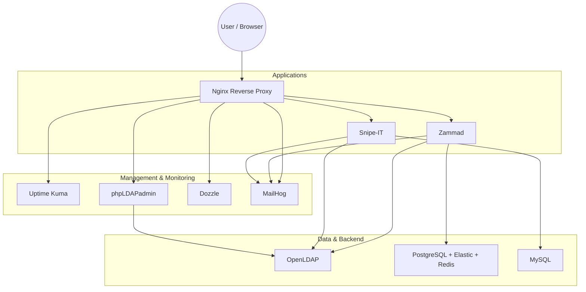

# Containerized Ticketing Infrastructure
**Status:** Operational

## 🎯 Project Objective
This project deploys a complete containerized IT infrastructure for ticket and IT inventory management. It uses **Docker Compose** to orchestrate multiple interconnected open-source services.

The infrastructure is deployed automatically, but fine-tuning of applications (LDAP, SMTP, etc.) is done via graphical interfaces to meet educational objectives and better understand the tools.

### Deployed Services
*   **Zammad:** Ticketing and customer support system.
*   **Snipe-IT:** IT inventory management (ITAM).
*   **OpenLDAP:** Centralized directory (pre-populated with users/groups).
*   **phpLDAPadmin:** Web interface for OpenLDAP management (visual user creation).
*   **Uptime Kuma:** Infrastructure monitoring.
*   **Dozzle:** Real-time log visualization.
*   **MailHog:** Test email server (SMTP trap).
*   **Nginx:** Reverse proxy for unified access via subdomains.

> ⚠️ **Note:** Strictly limited to test/lab environment (disposable data, non-secure passwords).

---

## 🏗️ Architecture

The infrastructure is organized into functional layers, accessible through a single entry point.



*(If the diagram above does not render, here is the text view:)*

*   **Entry Point:** Nginx (Reverse Proxy) handles routing `*.projet.lan`.
*   **Application Layer:** Zammad (Ticketing), Snipe-IT (Inventory).
*   **Management Layer:** phpLDAPadmin (Directory UI), Dozzle (Logs), Uptime Kuma (Monitoring).
*   **Backend Services:** OpenLDAP (Auth), PostgreSQL/MySQL (Databases), Elasticsearch, Redis.

---

## 📋 Prerequisites
*   **Git:** To clone the repository.
*   **Docker:** Version 20.10+ with Docker Compose V2.
*   **Web Browser:** To access interfaces.
*   **Resources:** At least **6 GB RAM** recommended (Elasticsearch + Zammad are resource-intensive).

---

## 🚀 Installation and Deployment

### 1. Clone the repository
```bash
git clone https://github.com/your-username/it-stack-project.git
cd it-stack-project
```

### 2. Configure the environment
Copy the example file and modify variables if needed (domain, passwords):
```bash
cp .env.example .env
```

### 3. DNS Configuration (Hosts file)
Add the local domains to your hosts file to access services.
*   **Windows:** `C:\Windows\System32\drivers\etc\hosts` (Run PowerShell as Admin)
*   **Linux/Mac:** `/etc/hosts`

```text
127.0.0.1 zammad.projet.lan snipeit.projet.lan mail.projet.lan monitor.projet.lan logs.projet.lan ldap.projet.lan
```

### 4. Start the stack
```bash
make setup
# OR manually:
# docker compose up -d
```

### 5. Initialization
*   **Automatic:** The setup container will populate OpenLDAP with test data and create the initial Admin user for Zammad.
*   **Manual Steps (Required):**
    *   **Snipe-IT:** Go to `http://snipeit.projet.lan` and complete the installation wizard.
    *   **Zammad:** Log in, then configure **LDAP** and **SMTP** integrations in the settings using the credentials below.
    *   **Uptime Kuma:** Create your admin account and configure probes.

---

## 🌐 Service Access

| Service | URL | Credentials / Status |
| :--- | :--- | :--- |
| **Zammad** | `http://zammad.projet.lan` | **Login:** `admin@projet.lan` <br> **Pass:** `admin123` |
| **Snipe-IT** | `http://snipeit.projet.lan` | **Status:** Complete Wizard <br> **DB:** `snipeit` / `snipeit` / `snipeit_password` |
| **phpLDAPadmin** | `http://ldap.projet.lan` | **Login:** `cn=admin,dc=projet,dc=lan` <br> **Pass:** (See `.env`) |
| **Uptime Kuma** | `http://monitor.projet.lan` | **Status:** Create admin account |
| **Dozzle** | `http://logs.projet.lan` | **Status:** Free access |
| **MailHog** | `http://mail.projet.lan` | **Status:** Free access |

### 👥 LDAP User Management
Users are pre-populated, but you can manage them via **phpLDAPadmin**:
1.  Go to `http://ldap.projet.lan`.
2.  Log in with the Admin DN.
3.  **Create new users manually** via the graphical interface (Create a child entry -> Generic: User Account).

**Default Test Users:**
*   **Tech N1:** thomas.dubois, sarah.martin
*   **Tech N2:** lucas.bernard, julie.petit
*   **Clients:** pierre.durand, marie.leroy
*   **Default password:** `password`

---

## 🛠️ Useful Commands

### Via Makefile (Recommended)
```bash
make setup       # 🚀 Complete setup (build + up + setup logs)
make up          # Start infrastructure
make down        # Stop infrastructure
make status      # Check containers status
make logs        # View logs of all services
make clean       # ⚠️ Complete cleanup (removes containers AND volumes)
```

### Via Docker Compose
```bash
docker compose up -d                 # Start
docker compose logs -f [service]     # Logs
docker compose restart [service]     # Restart specific app
docker compose down -v               # Remove everything
```

---

## 📁 Project Structure

```text
.
├── Makefile                   # Shortcuts for management
├── docker-compose.yml         # Main orchestration file
├── .env                       # Centralized configuration
├── README.md                  # Documentation
│
├── elasticsearch/             # Custom ES configuration
├── nginx/
│   └── conf.d/                # Reverse Proxy Configs (Vhosts)
├── openldap/
│   └── Dockerfile             # Custom LDAP image
├── scripts/                   # Init scripts (LDAP bootstrap, etc.)
└── zammad/                    # Zammad specific scripts
```

---

## 🔧 Customization
**Environment Variables (.env):**
*   `DOMAIN=projet.lan`: Base domain.
*   `LDAP_ROOT_PASSWORD`: Password for `cn=admin`.
*   `POSTGRES_PASSWORD` / `MYSQL_PASSWORD`: DB passwords.

**Adding Users:**
You can add users in `openldap/add-entries.ldif` before building, or simply use **phpLDAPadmin** after deployment.

---

## 📊 Project Status
*   ✅ **Infrastructure:** Deployed and functional.
*   ✅ **Monitoring:** Uptime Kuma and Dozzle integrated.
*   ✅ **LDAP:** Automatically populated + GUI management added.
*   🔄 **Configuration:** Manual configuration via GUI required for Zammad/Snipe-IT (Educational objective).

---

## 📄 License
This project is under MIT license - see the LICENSE file for details.